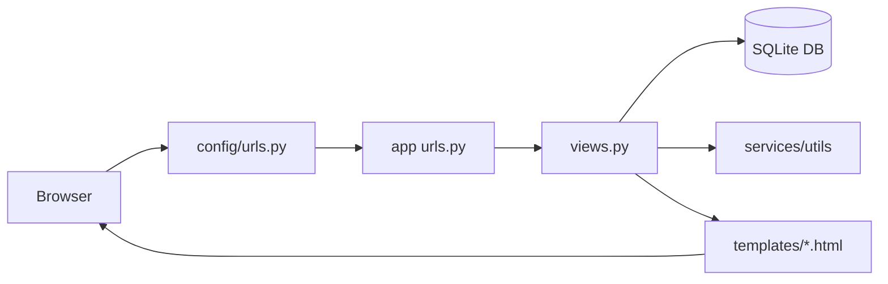
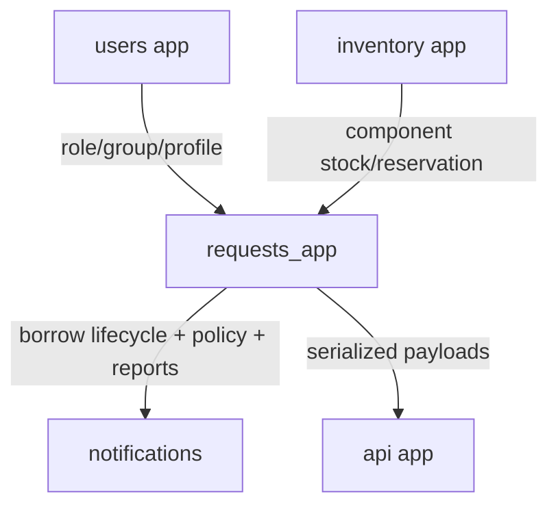
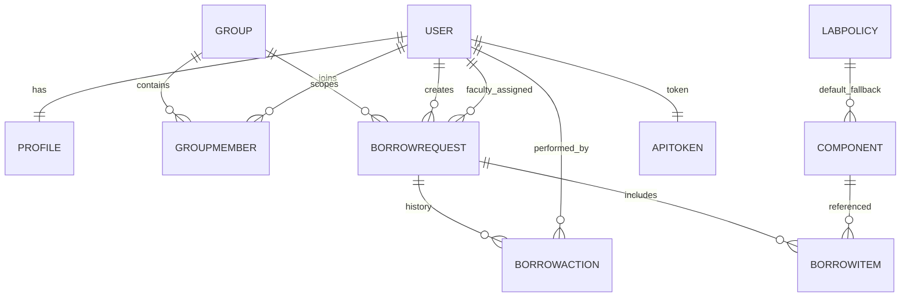

# LabTrack Django Master Tutorial (Project Anatomy Edition)

Last updated: March 5, 2026

## 0) Read This First
This tutorial is designed to teach Django by dissecting the LabTrack project itself.

What this file gives you:
- Complete architecture view.
- Folder and file anatomy across backend, frontend, API, and ops.
- How each subsystem works together.
- What we changed over time and why.
- How to safely adapt and extend the system.

Important truth:
- No one truly masters all of web development in one read.
- But one careful pass of this guide can give you a strong working mental model fast, even for beginners.

## 1) Project Goal in One Sentence
LabTrack is a role-based lab inventory + borrow lifecycle platform where students/faculty/admin users manage components, approvals, returns, penalties, policies, and reporting through web pages and token APIs.

## 2) Core Concepts (Child-Friendly + Engineer-Accurate)
- Browser: asks for a page.
- URL router: decides which code handles that page.
- View: business logic (checks role, reads/writes DB, returns response).
- Model: table definition for data.
- Template: HTML UI.
- Migration: DB schema version update.
- API endpoint: JSON output for apps like Flutter/Postman.
- Background task: periodic automation (cleanup/reminders).

## 3) System Architecture Graphs

### 3.1 Request Path (Web)


### 3.2 Request Path (API)
```mermaid
flowchart LR
A[Client: Postman/Mobile] --> B[/api/*]
B --> C[api/urls.py]
C --> D[api/views.py]
D --> E[api/auth.py token guard]
D --> F[api/serializers.py]
D --> G[(DB)]
D --> A
```

### 3.3 Apps and Data Ownership


### 3.4 Data Entity Relationship (Simplified)


## 4) Runtime Operation Anatomy

### 4.1 Authentication + OTP
- Signup submits form.
- OTP emailed and persisted in `users.EmailOTP`.
- Account created only after OTP verify.
- Password reset uses OTP verify flow too.
- Rate limiting protects OTP/token abuse.

### 4.2 Student Borrow Flow
- Student sees inventory (`inventory/views.py -> student_dashboard`).
- Add-to-cart creates reservation lock.
- Generate slip creates `BorrowRequest` + `BorrowItem` rows.
- Approval/issue/return transitions stored in `BorrowAction` audit.

### 4.3 Faculty + Admin Control
- Faculty: assigned requests + group approvals.
- Admin: overview dashboard (glimpse) + dedicated consoles:
  - requests
  - inventory
  - policy
  - analytics
  - maintenance
  - reports
  - profile

### 4.4 Fine/Policy Resolution
- Global defaults in `LabPolicy`.
- Per-component overrides in `inventory.Component` fine fields.
- Runtime penalty logic chooses component override first; if missing, fallback to policy default.

### 4.5 Profile Security Rules (Current)
- Username editable but globally unique.
- Full name alphabet+space only.
- Phone normalized and validated as India 10-digit mobile.
- Student/faculty email locks after verification.
- Admin email change requires OTP to new email and locks after verify.

## 5) Top-Level Folder Anatomy
- `config/`: global Django config (settings, root URLs, WSGI/ASGI, celery bootstrap).
- `users/`: identity/auth/signup/password-reset/profile/group domain.
- `inventory/`: component catalog + reservations + student cart + admin stock CRUD.
- `requests_app/`: borrow lifecycle engine + admin/faculty consoles + reporting + policy logic.
- `notifications/`: alert center generation.
- `api/`: token-auth JSON surface for external clients.
- `templates/`: UI rendering for all roles + auth + errors.
- `docs/`: living documentation and operational memory.

## 6) Complete File Atlas (What Each File Does)

### 6.1 `config/`
- `config/__init__.py`: package init + celery app export.
- `config/asgi.py`: ASGI entrypoint.
- `config/wsgi.py`: WSGI entrypoint.
- `config/celery.py`: celery app initialization.
- `config/settings.py`: environment, apps, middleware, DB/cache/session/security/email/rate-limit/celery schedules.
- `config/urls.py`: root route map and auth bootstrap routes.

### 6.2 `users/`
- `users/apps.py`: app config.
- `users/admin.py`: Django admin registrations.
- `users/models.py`: `Profile`, `Group`, `GroupMember`, `GroupRemovalRequest`, `EmailOTP`, `APIToken`.
- `users/forms.py`: signup/login/OTP/password-reset validation and normalization.
- `users/middleware.py`: no-store cache headers for authenticated HTML.
- `users/urls.py`: user/group/profile route map.
- `users/views.py`: OTP flow, dashboards, profile consoles, group approvals, group removal protocol.
- `users/tests/test_signup_flow.py`: OTP/signup behavior checks.
- `users/tests/test_dashboard_redirect.py`: role redirect correctness.
- `users/tests/test_auth_identity_and_cache.py`: identity login + cache header behavior.
- `users/migrations/*`: schema evolution from basic profile to OTP/API token/email lock/group indexes.

### 6.3 `inventory/`
- `inventory/apps.py`, `inventory/admin.py`: app + admin config.
- `inventory/models.py`: `Component`, `CartItem`, `Reservation` and stock constraints.
- `inventory/forms.py`: component admin forms and validation.
- `inventory/views.py`: student inventory/cart/requests and admin component CRUD.
- `inventory/tasks.py`: reservation cleanup scheduler task.
- `inventory/urls.py`: inventory route map.
- `inventory/tests.py`: base checks.
- `inventory/migrations/*`: category/limits/indexes/fine fields migration chain.

### 6.4 `requests_app/`
- `requests_app/models.py`: `BorrowRequest`, `BorrowItem`, `BorrowAction`, `LabPolicy`.
- `requests_app/views.py`: faculty/admin dashboards and all lifecycle actions.
- `requests_app/services/borrow_service.py`: centralized borrow operation routines.
- `requests_app/utils.py`: analytics/reporting/support computation helpers.
- `requests_app/tasks.py`: due reminder + overdue updater jobs.
- `requests_app/urls.py`: faculty/admin action routes.
- `requests_app/tests/test_slip_actions.py`: lifecycle action test coverage.
- `requests_app/management/commands/clear_expired_reservations.py`: maintenance command.
- `requests_app/migrations/*`: status expansion, group linking, policy model, indexing.

### 6.5 `notifications/`
- `notifications/views.py`: role-aware notification aggregation.
- `notifications/urls.py`: notification center route.
- `notifications/models.py`: app placeholder model file.

### 6.6 `api/`
- `api/auth.py`: token extraction/auth middleware-style decorator logic.
- `api/serializers.py`: payload shaping for profile/components/requests.
- `api/views.py`: token issue/logout, profile, components, requests, admin API operations.
- `api/urls.py`: API endpoint map with inline contracts.
- `api/tests.py`: API contract/security/access/rate-limit tests.

### 6.7 `templates/`
- `templates/base.html`: global theme/layout/toast/nav behavior.
- `templates/registration/*`: login/signup/OTP/password-reset pages.
- `templates/student/*`: dashboard/cart/group/profile/requests.
- `templates/faculty/*`: faculty dashboard/groups/profile.
- `templates/admin/*`: dashboard + all admin consoles.
- `templates/notifications/center.html`: alerts UI.
- `templates/400.html`..`500.html`: custom error pages.

## 7) URL and Console Map (Operational)

### 7.1 Core Web Routes
- `/accounts/login/`
- `/accounts/signup/`
- `/accounts/password-reset/`
- `/inventory/components/` (student inventory)
- `/inventory/cart/`
- `/inventory/requests/`
- `/requests/faculty/`
- `/requests/admin/` (overview glimpse)
- `/requests/admin/requests/` (main request console)
- `/requests/admin/component-console/`
- `/requests/admin/analytics/`
- `/requests/admin/maintenance/`
- `/requests/admin/reports-console/`
- `/users/student/profile-console/`
- `/users/faculty/profile-console/`
- `/users/admin/profile-console/`

### 7.2 API Routes
- `POST /api/auth/token/`
- `POST /api/auth/logout/`
- `GET /api/me/`
- `GET /api/components/`
- `GET /api/requests/`
- `GET /api/admin/overview/`
- `GET /api/admin/console-map/`
- `GET /api/admin/policy/`
- `POST /api/admin/policy/update/`
- `POST /api/admin/components/<id>/fines/`

## 8) How to Read Every Line of This Project (Method)
You asked for line-level mastery. The fastest practical method is structured reading:

### 8.1 Pass 1 (Map)
- Open each `urls.py` first.
- Draw route -> view function map.
- Ignore deep logic initially.

### 8.2 Pass 2 (Data)
- Read each `models.py` top to bottom.
- For each field ask:
  - Is it required?
  - Is it indexed?
  - Which workflows write it?
  - Which views read it?

### 8.3 Pass 3 (Validation)
- Read `forms.py` and helper validators in views.
- Track normalization rules (phone/email/name/usernames).

### 8.4 Pass 4 (Business Engine)
- Read `inventory/views.py`, then `requests_app/views.py` and `services/borrow_service.py`.
- Annotate each status transition and stock mutation.

### 8.5 Pass 5 (UI Binding)
- For every view, open linked template.
- Match each form field `name=` to POST keys in view code.
- Match each button action endpoint to url `name`.

### 8.6 Pass 6 (API Contracts)
- Read `api/urls.py` comments + `api/views.py` + `api/serializers.py`.
- Validate with Postman using `docs/API_POSTMAN_TESTING.md`.

### 8.7 Pass 7 (Proof)
- Read all tests and run them.
- If you cannot explain why each test exists, you have not fully mastered the flow yet.

## 9) Deep Anatomy by Concern

### 9.1 Authentication and Security
- Identity login supports username/email/full name (full-name ambiguity handled explicitly).
- OTP objects expire and are single-use.
- Cache-backed rate limiting guards token issue and OTP operations.
- `NoStoreForAuthenticatedPagesMiddleware` prevents stale private pages after logout.
- API tokens rotate on logout and expire by age/idle policy.

### 9.2 Inventory Integrity
- Reservation lock pattern prevents over-allocation.
- `available_stock` is operational stock; `total_stock` is physical total.
- Returned/rejected paths restore stock with action history.

### 9.3 Lifecycle and Auditability
- `BorrowRequest.status` encodes request state.
- `BorrowAction` guarantees timeline traceability.
- Admin/faculty rejection now includes remarks capture in modal flow.

### 9.4 Admin Experience Architecture
- Dashboard is now an overview lens only.
- Real operations moved to dedicated consoles for clarity.
- `admin/console-map` API gives canonical navigation map for clients.

## 10) Major Adaptations We Performed and Outcomes

### 10.1 Admin UX Restructure
Change:
- Split heavy admin page into dashboard glimpse + dedicated consoles.
Outcome:
- Lower cognitive load, faster task targeting, cleaner navigation model.

### 10.2 Per-Component Fine Structure
Change:
- Added component-level fine fields + API updates.
Outcome:
- Accurate penalties per hardware type, policy fallback still preserved.

### 10.3 Profile Integrity Hardening
Change:
- Username uniqueness enforcement, strict name/phone validation, email locking, admin email OTP verify flow.
Outcome:
- Better data hygiene and safer account identity stability.

### 10.4 Role Clarity Fixes
Change:
- Request queues and APIs shifted from student-only naming assumptions to requester-role aware fields.
Outcome:
- Correct behavior when faculty/admin-generated actions are present.

### 10.5 API Expansion
Change:
- Added admin overview/policy/fines endpoints with role checks.
Outcome:
- Mobile/external clients can perform operational reads/writes safely.

## 11) Possible Future Adaptations and How to Achieve

### 11.1 Department/Program Partitioning
Goal:
- Separate inventory/policies by department.
How:
- Add `department` on `Profile`, `Component`, and `BorrowRequest`.
- Scope queries by department in views/API.
- Add department filter to admin consoles.

### 11.2 Real-Time Alerts
Goal:
- Instant updates when approval/return happens.
How:
- Add Django Channels or websocket layer.
- Emit event on `BorrowAction` create.
- Subscribe dashboard cards to events.

### 11.3 Stronger Authorization Policies
Goal:
- Prevent any accidental cross-role action.
How:
- Extract role checks into reusable permission decorators.
- Add positive and negative role tests for each action endpoint.

### 11.4 Safer Production Deployment
Goal:
- Enterprise-ready operations.
How:
- Move from SQLite to PostgreSQL.
- Use Redis cache and celery broker in production.
- Enforce env-based secret/key rotation.
- Add structured logging and audit exports.

### 11.5 API Versioning
Goal:
- Backward compatible client upgrades.
How:
- Introduce `/api/v1/` namespace.
- Keep legacy fields until deprecation window ends.
- Publish versioned changelog.

## 12) Testing Master Plan

### 12.1 Baseline Commands
```bash
python manage.py check
python manage.py makemigrations --check --dry-run
python manage.py migrate
python manage.py test
python manage.py test api -v 2
```

### 12.2 What “Complete” Means Here
- Unit tests pass.
- Role-based route protection verified.
- API auth and permission boundaries verified.
- Critical state transitions tested (`PENDING -> APPROVED/REJECTED/ISSUED/RETURNED/...`).
- UI form-field name and backend POST-key alignment validated.

## 13) Beginner-to-Advanced Reading Path (Single Pass)
1. Read this file once fully.
2. Open `config/urls.py` and trace every include.
3. Read `users/models.py`, `inventory/models.py`, `requests_app/models.py`.
4. Read `users/views.py` (auth/profile/group).
5. Read `inventory/views.py` (cart/reservation/slip generation).
6. Read `requests_app/services/borrow_service.py` then `requests_app/views.py`.
7. Read templates for one role at a time (student -> faculty -> admin).
8. Run tests and map each test to a business rule.
9. Call API endpoints in Postman from `docs/API_POSTMAN_TESTING.md`.

## 14) Line-by-Line Annotation Strategy for Children and New Learners
For each line, ask exactly one question:
- Import line: “What tool does this bring?”
- Constant line: “What default rule is being set?”
- Function definition: “What single job should this function do?”
- Condition (`if`): “What case is being protected?”
- Query line: “Which table and which rows are fetched?”
- Save/update line: “Which data changed and why?”
- Return/render line: “What is sent back to user/client?”

If every line can answer one of these, you are truly understanding code, not memorizing it.

## 15) Final Practical Truth
Mastery is repetition + building features + fixing bugs + reading tests.
This tutorial gives you the map. Real mastery comes when you:
- add one small feature,
- write tests for it,
- break it,
- debug it,
- and ship it cleanly.

That is exactly how this LabTrack codebase evolved.

## 16) Full File Inventory Snapshot (Line Counts)
Use this as the complete reading checklist for file-by-file study.

```text
0 api/__init__.py
6 api/apps.py
39 api/auth.py
0 api/migrations/__init__.py
56 api/serializers.py
225 api/tests.py
66 api/urls.py
324 api/views.py
3 config/__init__.py
16 config/asgi.py
9 config/celery.py
219 config/settings.py
30 config/urls.py
16 config/wsgi.py
0 inventory/__init__.py
15 inventory/admin.py
5 inventory/apps.py
40 inventory/forms.py
37 inventory/migrations/0001_initial.py
40 inventory/migrations/0002_component_category_alter_cartitem_student_and_more.py
23 inventory/migrations/0003_component_faculty_limit_component_student_limit.py
59 inventory/migrations/0004_alter_component_available_stock_and_more.py
18 inventory/migrations/0005_add_indexes.py
23 inventory/migrations/0006_alter_reservation_unique_together_and_more.py
33 inventory/migrations/0007_component_fine_damaged_component_fine_missing_parts_and_more.py
0 inventory/migrations/__init__.py
79 inventory/models.py
14 inventory/tasks.py
3 inventory/tests.py
17 inventory/urls.py
475 inventory/views.py
0 notifications/__init__.py
3 notifications/admin.py
5 notifications/apps.py
0 notifications/migrations/__init__.py
3 notifications/models.py
3 notifications/tests.py
6 notifications/urls.py
72 notifications/views.py
0 requests_app/__init__.py
23 requests_app/admin.py
5 requests_app/apps.py
17 requests_app/management/commands/clear_expired_reservations.py
38 requests_app/migrations/0001_initial.py
18 requests_app/migrations/0002_alter_borrowrequest_status.py
23 requests_app/migrations/0003_borrowrequest_due_date_borrowrequest_reminder_sent.py
18 requests_app/migrations/0004_borrowrequest_group.py
29 requests_app/migrations/0005_set_group_and_due_default.py
18 requests_app/migrations/0006_borrowrequest_return_condition.py
18 requests_app/migrations/0007_borrowrequest_return_time.py
65 requests_app/migrations/0008_remove_borrowrequest_counsellor_and_more.py
112 requests_app/migrations/0009_faculty_fk_actions_user_not_null.py
31 requests_app/migrations/0010_alter_borrowaction_action_and_more.py
20 requests_app/migrations/0011_borrowrequest_group.py
18 requests_app/migrations/0012_borrowrequest_cart_locked_at.py
32 requests_app/migrations/0013_labpolicy_alter_borrowaction_options.py
17 requests_app/migrations/0014_alter_borrowaction_options.py
45 requests_app/migrations/0015_borrowaction_borrowaction_req_ts_idx_and_more.py
0 requests_app/migrations/__init__.py
273 requests_app/models.py
2 requests_app/services/__init__.py
71 requests_app/services/borrow_service.py
58 requests_app/tasks.py
1 requests_app/tests/__init__.py
151 requests_app/tests/test_slip_actions.py
23 requests_app/urls.py
260 requests_app/utils.py
930 requests_app/views.py
49 templates/400.html
49 templates/403.html
51 templates/403_csrf.html
81 templates/404.html
77 templates/500.html
12 templates/admin/component_confirm_delete.html
142 templates/admin/component_console.html
143 templates/admin/component_form.html
77 templates/admin/components.html
116 templates/admin/dashboard.html
386 templates/admin/data_console.html
95 templates/admin/faculty_console.html
65 templates/admin/groups.html
126 templates/admin/maintenance_queue.html
71 templates/admin/profile_console.html
65 templates/admin/reports_console.html
276 templates/admin/request_console.html
88 templates/admin/student_console.html
474 templates/base.html
325 templates/faculty/dashboard.html
65 templates/faculty/groups.html
47 templates/faculty/profile_console.html
134 templates/notifications/center.html
12 templates/registration/logged_out.html
71 templates/registration/login.html
48 templates/registration/password_reset_otp_confirm.html
90 templates/registration/password_reset_otp_request.html
252 templates/registration/signup.html
116 templates/student/cart.html
189 templates/student/dashboard.html
152 templates/student/group_console.html
55 templates/student/profile_console.html
58 templates/student/requests.html
0 users/__init__.py
14 users/admin.py
5 users/apps.py
282 users/forms.py
32 users/middleware.py
25 users/migrations/0001_initial.py
28 users/migrations/0002_profile_group_id_profile_semester_and_more.py
28 users/migrations/0003_profile_faculty_incharge_profile_full_name_and_more.py
38 users/migrations/0004_group_groupmember.py
18 users/migrations/0005_profile_group_name.py
45 users/migrations/0006_seed_lab_admin.py
43 users/migrations/0007_seed_lab_admin_account.py
33 users/migrations/0008_groupremovalrequest.py
28 users/migrations/0009_emailotp.py
27 users/migrations/0010_apitoken.py
41 users/migrations/0011_alter_profile_group_id_alter_profile_role_and_more.py
31 users/migrations/0012_profile_email_locked_and_emailotp_admin_email_change.py
0 users/migrations/__init__.py
191 users/models.py
1 users/tests/__init__.py
39 users/tests/test_auth_identity_and_cache.py
51 users/tests/test_dashboard_redirect.py
85 users/tests/test_signup_flow.py
16 users/urls.py
892 users/views.py
```

## 17) Direct File-and-Line Reading Guide (Jump Map)
Use this section as a guided navigation index. Open each file and jump to the line numbers.

### 17.1 Global Django Wiring
- `config/settings.py:20` -> Celery beat schedule (automated background jobs).
- `config/settings.py:77` -> Installed apps (project module boundaries).
- `config/settings.py:92` -> Middleware chain (request/response behavior stack).
- `config/settings.py:127` -> Database config.
- `config/settings.py:138` and `config/settings.py:145` -> Cache backend paths.
- `config/settings.py:200` -> Auth/OTP rate-limit base window.
- `config/settings.py:205` -> API token issue rate limit.
- `config/urls.py:13` -> Root URL router and include structure.

### 17.2 Users App (Identity, OTP, Profile, Groups)
- `users/models.py:14` -> `Profile` model (role + profile state).
- `users/models.py:98` -> `GroupRemovalRequest` dual-consent model.
- `users/models.py:140` -> `EmailOTP` lifecycle model.
- `users/models.py:177` -> `APIToken` model.
- `users/views.py:135` -> `LabTrackLoginView` (identity login UI class).
- `users/views.py:182` -> signup + OTP gated account creation.
- `users/views.py:336` -> password reset OTP request flow.
- `users/views.py:370` -> password reset OTP confirm flow.
- `users/views.py:538` -> admin profile console (email OTP verify + lock).
- `users/views.py:634` -> student profile console (immutable email behavior).
- `users/views.py:829` -> faculty profile console (immutable email behavior).
- `users/urls.py:4` -> users route map.

### 17.3 Inventory App (Components, Cart, Reservations)
- `inventory/models.py:6` -> `Component` stock + fine override fields.
- `inventory/models.py:39` -> `Reservation` lock model.
- `inventory/views.py:86` -> student component dashboard query/filter flow.
- `inventory/views.py:151` -> add-to-cart reservation logic.
- `inventory/views.py:282` -> slip generation trigger.
- `inventory/views.py:388` -> admin component list/filters.
- `inventory/views.py:420` -> admin component create.
- `inventory/views.py:438` -> admin component edit.
- `inventory/views.py:457` -> admin component delete.
- `inventory/urls.py:5` -> inventory route map.

### 17.4 Requests App (Borrow Lifecycle + Admin Consoles)
- `requests_app/models.py:10` -> `BorrowRequest` status model.
- `requests_app/models.py:189` -> `BorrowItem` quantity mapping.
- `requests_app/models.py:217` -> `BorrowAction` audit timeline.
- `requests_app/models.py:250` -> `LabPolicy` global defaults.
- `requests_app/views.py:207` -> faculty dashboard flow.
- `requests_app/views.py:351` -> admin dashboard (overview/glimpse).
- `requests_app/views.py:361` -> admin request console.
- `requests_app/views.py:392` -> component policy console.
- `requests_app/views.py:438` -> analytics console.
- `requests_app/views.py:681` -> maintenance queue.
- `requests_app/views.py:726` -> reports console.
- `requests_app/views.py:757` -> terminate/reject action path.
- `requests_app/views.py:783` -> mark returned.
- `requests_app/views.py:812` -> mark issued.
- `requests_app/views.py:839` -> mark penalty.
- `requests_app/views.py:876` -> approve slip.
- `requests_app/services/borrow_service.py:1` -> core borrow operation helpers.
- `requests_app/urls.py:5` -> requests route map.

### 17.5 API App (Token + JSON Contracts)
- `api/auth.py:10` -> token auth decorator.
- `api/serializers.py:7` -> profile serializer.
- `api/serializers.py:20` -> component serializer.
- `api/serializers.py:36` -> borrow request serializer.
- `api/views.py:59` -> token issue endpoint.
- `api/views.py:102` -> token logout endpoint.
- `api/views.py:109` -> `/api/me/`.
- `api/views.py:115` -> `/api/components/`.
- `api/views.py:126` -> `/api/requests/`.
- `api/views.py:149` -> admin overview endpoint.
- `api/views.py:198` -> admin console map endpoint.
- `api/views.py:221` -> admin policy read endpoint.
- `api/views.py:246` -> admin policy update endpoint.
- `api/views.py:289` -> admin component fines update endpoint.
- `api/urls.py:5` -> API route registry.

### 17.6 Notifications and UI Skeleton
- `notifications/views.py:13` -> notification center generation logic.
- `notifications/urls.py:4` -> notifications route.
- `templates/base.html:1` -> global shell, navbar, theme, toast behavior.
- `templates/admin/request_console.html:1` -> admin request operations UI.
- `templates/admin/component_console.html:1` -> policy UI.
- `templates/admin/profile_console.html:1` -> admin profile + email OTP verify UI.
- `templates/faculty/dashboard.html:1` -> faculty operations UI.
- `templates/student/dashboard.html:1` -> student discovery UI.
- `templates/student/cart.html:1` -> team cart/reservation UI.
- `templates/student/profile_console.html:1` -> student profile UI.
- `templates/registration/signup.html:1` -> OTP-gated signup UI.
- `templates/registration/login.html:1` -> identity login UI.

### 17.7 Tests (Proof of Behavior)
- `users/tests/test_signup_flow.py:1` -> signup/OTP expectations.
- `users/tests/test_dashboard_redirect.py:1` -> role redirect behavior.
- `users/tests/test_auth_identity_and_cache.py:1` -> identity login and cache safety.
- `requests_app/tests/test_slip_actions.py:1` -> lifecycle action correctness.
- `api/tests.py:1` -> API contract, auth, role access, rate-limit checks.

### 17.8 Recommended “One-Day Mastery” Reading Sequence
1. `config/urls.py:13`
2. `users/models.py:14`, then `users/views.py:182`, `336`, `370`, `538`
3. `inventory/models.py:6`, then `inventory/views.py:86`, `151`, `282`
4. `requests_app/models.py:10`, then `requests_app/views.py:351`, `361`, `757`, `783`, `812`, `876`
5. `api/urls.py:5`, `api/auth.py:10`, `api/views.py:59`, `109`, `149`, `221`, `246`, `289`
6. `templates/base.html:1`, then role templates (`student`, `faculty`, `admin`)
7. all tests listed in 17.7
